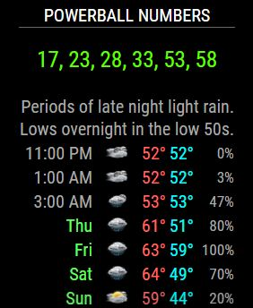
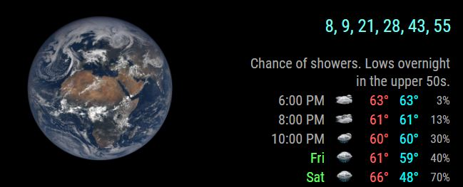

# MMM-Lottery
A MagicMirror module that gives you lottery numbers ranging from 0 to 59, coninciding with US Powerball numbers. 

## Examples

With header centered and colored numbers centered

With no header and colored numbers aligned to the right

## Info

* Uses very little of your precious mirror real estate. Fits anywhere!
* Make it bigger. Make it smaller. Color it. Align it. Make it yours!
* The .css file included helps you modify size, position and color of text.
* Need a color chart? No problem. http://htmlcolorcodes.com/color-picker/

## Installation

* `git clone https://github.com/mykle1/MMM-Lottery.git` into the `~/MagicMirror/modules` directory.

## Add to Config.js

    {
        module: "MMM-Lottery",
        position: "top_right", // Anywhere!
        config: {
            maxWidth: "100%",    
            header: ""         // Header text inside quotes
        }
    },

## Config Options

| **Option** | **Default** | **Description** |
| --- | --- | --- |
| `maxWidth` | `100%` | Stretch across top_bar,bottom_bar, thirds. |
| `header` | `text` | I'm not a fan of headers but the option is yours. |
| `animationSpeed` | `3000` | Transition speed in ms. |
| `updateInterval` | `5*60*1000` | 5 minutes. |
| `initialLoadDelay` | `3250` | Module load delay in ms. |
| `retryDelay` | `2500`  |Delay to retry fetching data. |